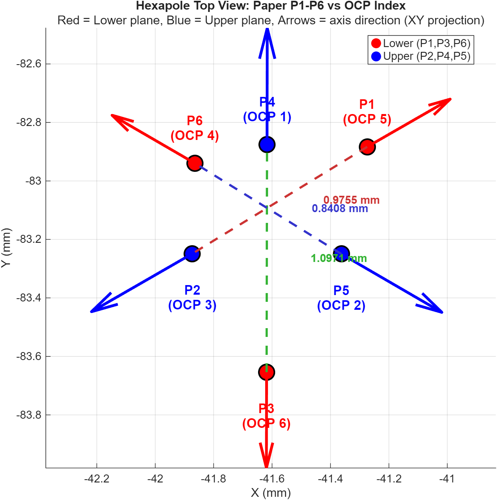

# Magnetic-Tweezer-FEM

Hexapole magnetic tweezer FEM simulation project. CAD geometry preprocessing pipeline for converting SolidWorks designs into ANSYS-ready FEM models.

## Hexapole Pole Configuration



| Plane | Poles |
|-------|-------|
| Upper (blue) | P2 (+90°), P4 (-30°), P5 (-150°) |
| Lower (red)  | P1 (-90°), P3 (+150°), P6 (+30°) |

**Opposing pairs:** P1↔P2, P3↔P4, P5↔P6

## Directory Structure

```
├── cad/                  Original STEP geometry (exported from SolidWorks)
│   ├── Hexapole_Assembly.STEP
│   └── parts/            Individual part STEP files
├── fem/                  FEM-ready simplified geometry
│   ├── Hexapole_Assembly_FEM.STEP   Final model (holes filled, tips aligned)
│   └── parts/            Simplified individual parts
├── scripts/              CadQuery/Python preprocessing scripts
├── reference/            Fei Long 2016 dissertation reference design
│   ├── MTmodel.step      Reference hexapole model
│   └── apdl/             ANSYS APDL simulation scripts (Coil 1-6)
└── figures/              Visualization outputs
```

## Scripts

All scripts use [CadQuery](https://cadquery.readthedocs.io/) + OpenCascade.

| Script | Purpose |
|--------|---------|
| `scripts/fill_holes.py` | Remove screw holes from STEP parts for cleaner FEM mesh |
| `scripts/adjust_pole_z.py` | Adjust upper pole positions for 1.0 mm tip-to-tip distance |
| `scripts/verify_tip_alignment.py` | Verify opposing pole pair colinearity |
| `scripts/plot_pole_mapping.m` | MATLAB visualization of pole positions and mapping |

## Requirements

- Python 3.10+
- [CadQuery](https://cadquery.readthedocs.io/) (`pip install cadquery`)
- MATLAB R2020a+ (for plotting only)

## Reference

Based on the hexapole electromagnetic actuation system described in:

> Fei Long, "Active Control of the Probe-Sample Interaction Force at the Piconewton Scale by a Magnetic Microprobe in Aqueous Solutions," PhD dissertation, 2016.
